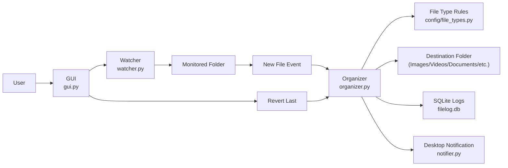
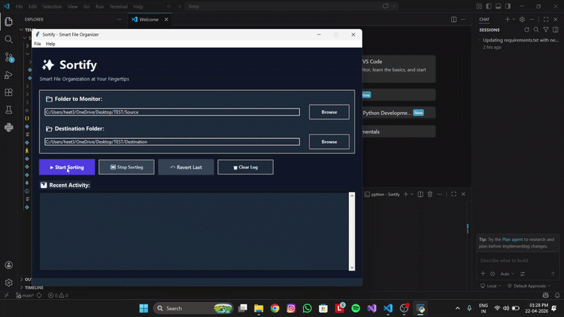

# Sortify - Smart File Organizer

## Project Description
Sortify is a Python automation app that monitors a folder in real time and automatically organizes new files into category-based folders such as Images, Videos, Music, Documents, Archives, and Others.

It includes a Tkinter desktop UI, real-time monitoring with `watchdog`, file movement by extension rules, desktop notifications, and SQLite logging for tracking and revert support.

## Features
- Real-time folder monitoring using `watchdog`
- Automatic file organization based on extension rules
- Tkinter GUI for selecting source/destination folders and starting sorting
- Revert support for the most recently moved file
- SQLite logging of move/revert actions
- Ignore temporary or partial files (for example: `.crdownload`, `.part`, `.tmp`)

## Workflow
1. The watcher monitors a selected source folder for newly created files.
2. New files are checked against extension-to-category mappings.
3. Matching files are moved to the appropriate destination subfolder.
4. Move actions are logged to SQLite for tracking and revert support.
5. The app sends notifications when file movement completes.

## Project Structure
- `main.py` - Application entry point
- `gui.py` - Tkinter interface and controls
- `watcher.py` - Real-time monitoring logic
- `organizer.py` - Core sorting and revert logic
- `database.py` - SQLite setup and logging operations
- `notifier.py` - Desktop notification handling
- `config/file_types.py` - Extension-to-category mapping
- `config.json` - Runtime configuration
- `filelog.db` - SQLite database file
- `logs/app.log` - Application logs

## Tech Stack
- Python
- Tkinter
- watchdog
- sqlite3
- os/shutil/pathlib

## Installation and Run
```bash
# 1) Open terminal in project folder
cd Sortify

# 2) Install dependencies
pip install -r requirements.txt

# 3) Run the app
python main.py
```

## How to Use
1. Select the folder to monitor.
2. Select the destination folder.
3. Click **Start Sorting**.
4. Add files to the monitored folder and watch Sortify organize them.
5. Use **Revert Last** to move the most recently moved file back.

## Architecture Flowchart


## Demo
[](https://drive.google.com/file/d/18eKSVJPgceZeovLAZ4sIMpXyMEMIWKXc/view?usp=drive_link)

Direct video link: `https://drive.google.com/file/d/18eKSVJPgceZeovLAZ4sIMpXyMEMIWKXc/view?usp=drive_link`

## Team Contribution
1. **GUI and notification sending** - Dhyan Shah
2. **Core logic and coding** - Heet Shah
3. **Project structure and code working** - Samith Samani
