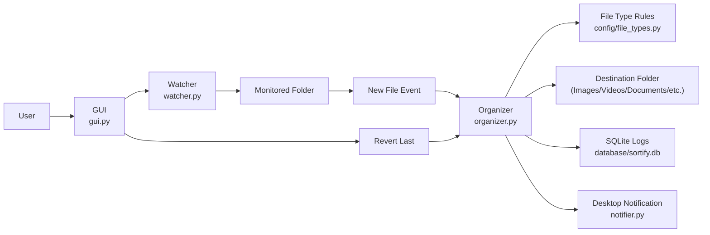

# Sortify — Smart File Organizer

## Project Description
Sortify is a Python desktop automation project that monitors a selected folder in real time and automatically organizes files into category-based folders (Images, Videos, Music, Documents, Archives, and Others).

The project includes:
- A modern Tkinter GUI for selecting folders and controlling the sorter.
- Real-time folder monitoring using `watchdog`.
- Automatic file movement based on extension mapping.
- Desktop notifications when files are moved.
- Ignoring partially downloaded/temporary install files.
- Revert support for the latest moved file.
- SQLite logging of move/revert actions.

## Project Structure
- `main.py` — Application entry point.
- `gui.py` — User interface and controls.
- `watcher.py` — Real-time monitoring logic.
- `organizer.py` — Core file-sorting and revert logic.
- `database.py` — SQLite setup and logging operations.
- `notifier.py` — Desktop notification handling.
- `config/file_types.py` — File extension to category mapping.
- `database/sortify.db` — SQLite database file.
- `logs/app.log` — Application log output.

## Steps to Run Project

```bash
# 1) Open terminal in project folder
cd Sortify

# 2) Install required libraries
pip install -r requirements.txt

# 3) Run the project
python main.py
```

### How to Use
1. Select the folder to monitor.
2. Select the destination folder.
3. Click **Start Sorting**.
4. Add files to the monitored folder and watch Sortify organize them automatically.
5. Use **Revert Last** if you want to move the latest file back to its original location.

## Notification Feature
- Sortify sends a desktop notification whenever a file is moved successfully.
- Notification message includes the file name and the folder where it was moved.
- This helps users track automated actions in real time without constantly checking the app window.

## Ignoring Partial/Temporary Files
- Sortify is configured to ignore partially downloaded or temporary install files.
- This prevents incomplete files from being moved before they are fully available.

## Team Contribution
1. **GUI and notification sending** — Dhyan Shah  
2. **Core logic and coding** — Heet Shah  
3. **Project structure and code working** — Samith Samani

## Architecture Flowchart



## Working Project Video
Add your project demo video link below before final submission:

- Video Link: `PASTE_YOUR_VIDEO_LINK_HERE`

Suggested demo flow:
1. Open the app.
2. Select monitor and destination folders.
3. Start sorting.
4. Add sample files (`.jpg`, `.pdf`, `.mp3`) and show auto-organization.
5. Show desktop notification.
6. Use **Revert Last** and show file restored.
